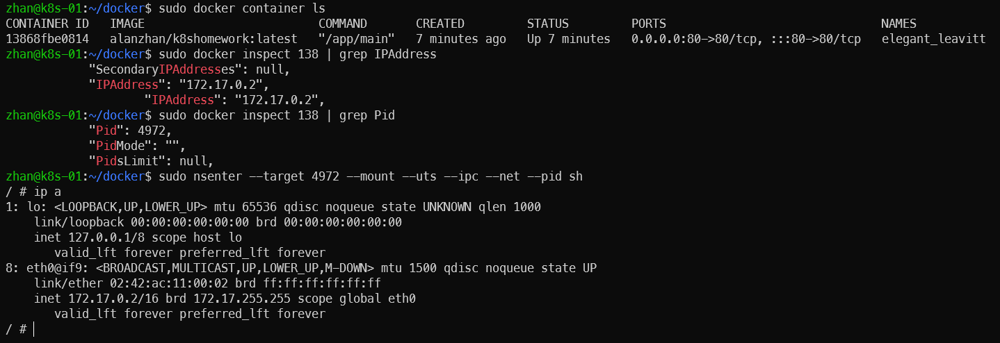

1. 建构本地镜像
> docker build -t alanzhan/k8shomework:latest .
2. 编写 Dockerfile  将练习 2.2 编写的 httpserver 容器化

``` Dockerfile
FROM golang:alpine AS build
WORKDIR /src
ADD . /src
RUN cd /src && go build main.go

# final stage
FROM alpine:latest
WORKDIR /app
COPY --from=build /src/main /app/main
EXPOSE 80
ENTRYPOINT ["/app/main"]
```

3. 将镜像推送至 docker 官方镜像仓库
> https://hub.docker.com/layers/alanzhan/k8shomework/latest/images/sha256-bcdaa84e9bd415d72aff0d0a5ae532b64dd7b0fecef11bdd4c0b03c5f7284b4a?context=explore
4. 通过 docker  命令本地启动 httpserver
> docker run -p 80:80 alanzhan/k8shomework:latest
5. 通过 nsenter 进入容器查看 IP 配置
> 