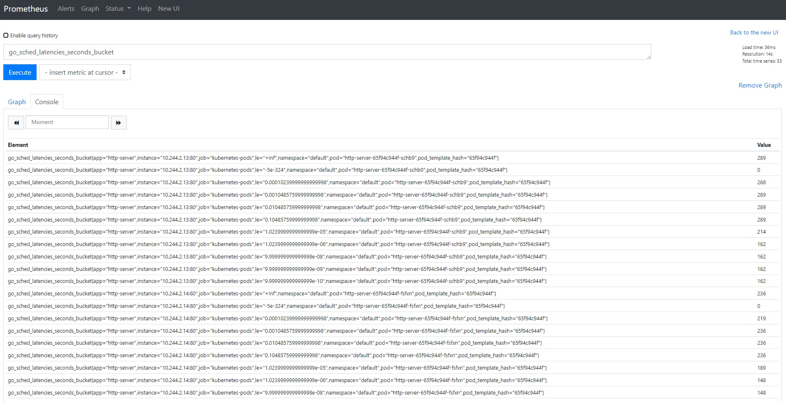

模块十作业（必交）
1. 为 HTTPServer 添加 0-2 秒的随机延时；
2. 为 HTTPServer 项目添加延时 Metric；
3. 将 HTTPServer 部署至测试集群，并完成 Prometheus 配置；
4. 从 Promethus 界面中查询延时指标数据；
----
1. install grafana and prometheus
``` bash
helm repo add grafana https://grafana.github.io/helm-charts
helm repo update
helm upgrade --install loki grafana/loki-stack --set grafana.enabled=true,prometheus.enabled=true,prometheus.alertmanager.persistentVolume.enabled=false,prometheus.server.persistentVolume.enabled=false
```

2. docker build http-server
``` bash
sudo docker build -t alanzhan/k8shomework:1.0.3 .
sudo docker push alanzhan/k8shomework:1.0.3
```

3. apply deployment
``` bash
kubectl apply -y httpserver-deployment.yml
```

