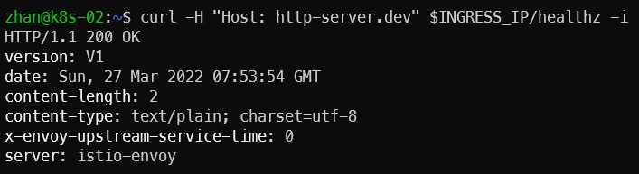

把我们的 httpserver 服务以 Istio Ingress Gateway 的形式发布出来。

1. install istio
``` bash 
curl -L https://git.io/getLatestIstio | ISTIO_VERSION=1.12.0 sh -
cd istio-1.12.0/
sudo cp bin/istioctl /usr/local/bin
istioctl install --set profile=demo -y
```

2. deploy http-server
``` bash
kubectl apply -f httpserver-config.yml
kubectl apply -f httpserver-deployment.yml
kubectl apply -f httpserver-service.yml
```

3. deploy istio gateway
``` bash
kubectl apply -f istio-spec.yml
```

4. check
``` bash
kubectl get service -n istio-system | grep istio-ingressgateway | awk '{print $3}' | export INGRESS_IP=
curl -H "Host: http-server.dev" $INGRESS_IP/healthz -i
```


